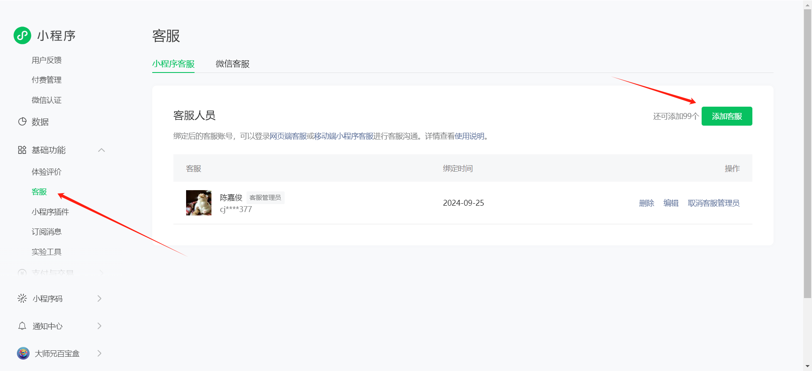

# 预览：

# 项目介绍

# 
证件照伴侣-uniapp多端兼容版

我给你的，就是我想要的，我爱你的方式，就是我希望被爱的方式.

**相关项目**：

- 小程序后端请前往：
- gitee: https://gitee.com/wmlcjj/ai-idphoto
- github: https://github.com/wmlcjj/ai-idphoto
- 

- 基于此项目二开：https://github.com/no1xuan/photo
- 改动点：
- 1、支持本地存储、阿里云OSS、腾讯云COS等各种对象存储云平台（支持私有存储、防止防盗刷）
- 2、支持微信H5、微信小程序等多端项目（其他小程序没测试过）
- 3、多端统一用户体系
------

# ⭐最近更新
- 2024.09.23: 增加个人中心，优化拍照技巧，优化定制尺寸，修复首点击部分功能会出现重复跳转2次的问题
------

# 🔧部署

打开项目后,打开commom/apiConfig.js文件，修改地址就好啦

## 隐私协议

## 客服配置

## 📧其它

您可以通过以下方式联系我:

微信：cjj113377
